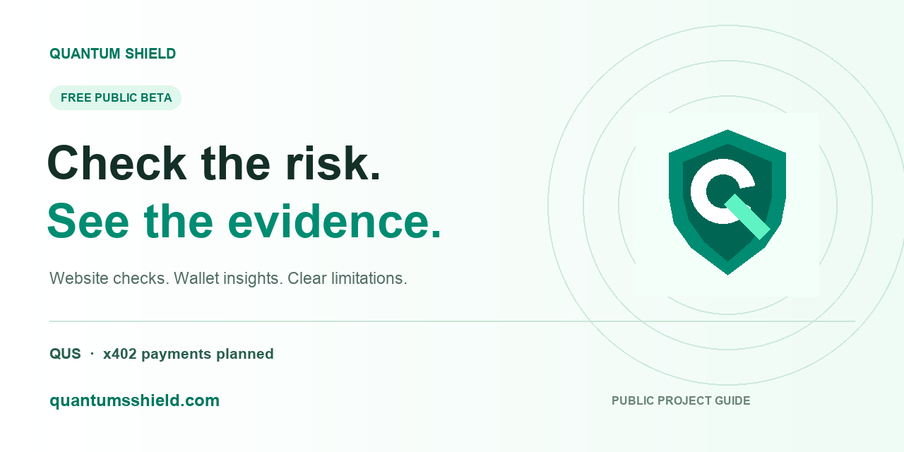

# Quantum Shield

**Website risk checks. Multichain wallet insights. Evidence you can inspect.**

[Website](https://quantumsshield.com/) · [X](https://x.com/quantumsshield) · [Telegram Chat](https://t.me/QuntumsShield) · [Telegram Channel](https://t.me/QuntumShield)

Public tools for examining suspicious websites and understanding on-chain wallet data.

[Use Quantum Shield](https://quantumsshield.com/) · [Safety Center](https://quantumsshield.com/safety) · [Wallet tools](https://quantumsshield.com/tools) · [White paper](WHITEPAPER.md)

## What you can use today

| Live product | What it does |
| --- | --- |
| [Website Code + AI Review](https://quantumsshield.com/safety#deep) | Reviews a bounded selection of public website source for warning signs, with evidence and limitations. |
| [Domain Reputation](https://quantumsshield.com/safety) | Checks reported threats and suspicious URL patterns. |
| [Wallet Scanner](https://quantumsshield.com/tools?product=wallet) | Reads native balance, account type, nonce, and source-block evidence. |
| [Token Check](https://quantumsshield.com/tools?product=token) | Reads contract-reported token metadata and supply. |
| [Wallet Compare](https://quantumsshield.com/tools?product=compare) | Compares two addresses at the same block on one selected network. |
| Wallet Activity | Displays recent Ethereum and Base explorer activity with available public labels. |
| Image File Check | Checks supported image file headers locally; it is not an antivirus scan. |

Wallet Scanner, Token Check, and Wallet Compare support **Ethereum, Base, BNB Chain, Arbitrum, and Polygon**. Public beta tools are free within usage limits and require no owner account. Paste a public address or connect a compatible browser wallet; these checks do not request a signature.

An unflagged result is not proof of safety. Website review does not execute every interaction or simulate wallet transactions. Wallet snapshots are not quantum-safety certifications. Availability depends on public data providers.

## Documentation

- [White paper](WHITEPAPER.md)
- [Product roadmap](ROADMAP.md)
- [Public API guide](API-GUIDE.md)
- [Download white paper PDF](https://quantumsshield.com/downloads/quantum-shield-whitepaper-v1.pdf)
- [Public API schema](https://quantumsshield.com/openapi.json)

## QUS and planned payments

QUS is the planned service-payment token, with a planned total supply of **1,000,000,000 QUS**. QUS payments and x402 micropayments for agents are future integrations, not active beta features. No token contract or launch is announced here. This repository does not specify allocations or tokenomics.

## What this repository contains

This is Quantum Shield's public documentation and brand repository. It is not the deployable application source. Backend implementation, detection logic, private administration, infrastructure configuration, and credentials are intentionally excluded. The live service is available at [quantumsshield.com](https://quantumsshield.com/).

## Feedback

For ordinary product feedback, describe the page, steps, and expected result. Never include seed phrases, private keys, passwords, API keys, personal information, or confidential security findings in public issues.

## Public code example

[Read-only wallet API example](example-wallet.mjs) demonstrates using the public service with Node.js 22 or newer. No keys or wallet signatures are needed. It is not the backend source.

## Official community

[Website](https://quantumsshield.com/) · [X](https://x.com/quantumsshield) · [Telegram Chat](https://t.me/QuntumsShield) · [Telegram Channel](https://t.me/QuntumShield)

Use these official channels for product updates. No token contract is announced in this repository.
